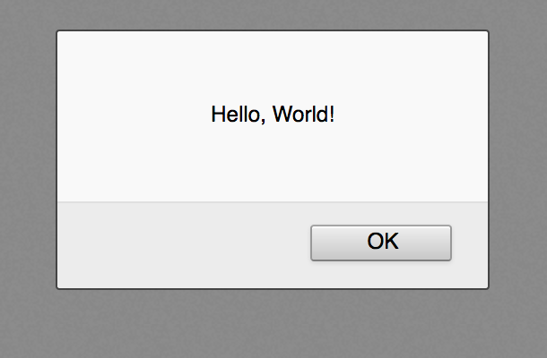
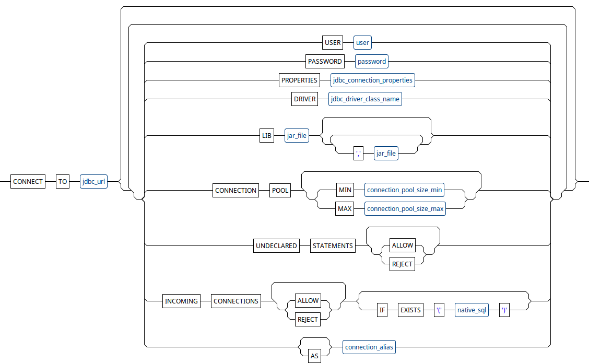
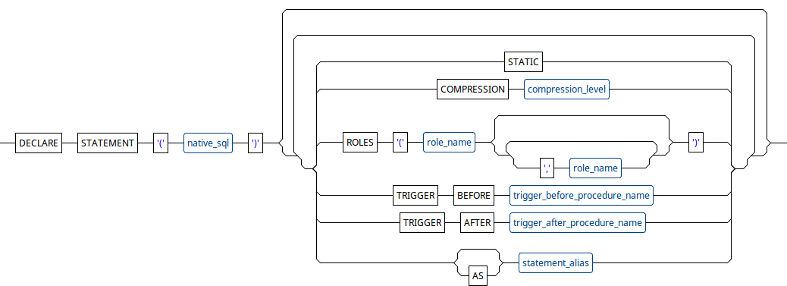
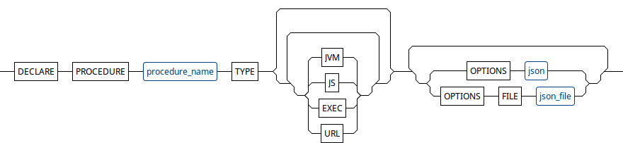
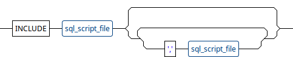

<h1>FBSQL - Frontend Backend SQL</h1>
Work (secure) with your backend database within HTML<br>
<br><br>
<strong>What is FBSQL?</strong><br>
FBSQL is a server that transparently yet secure connects your frontend to the remote database.<br>
<br>
<strong>Is it really two-tier architecture?</strong><br>
Well, yes and no. Look at the FBSQL as two-tier architecture with third tier under the hood.<br>
<br>
<strong>Which databases are supported?</strong><br>
FBSQL supports any <abbr title="Java Database Connectivity">JDBC</abbr> compliant databases like SQLite, MySQL, PostgreSQL, Oracle, Microsoft SQL Server, IBM Db2 etc.
All you need is <abbr title="Java Database Connectivity">JDBC</abbr> driver for your database.<br>
<br>
<strong>What about security?</strong><br>
FBSQL security is based on the principle of least privilege (<abbr title="Principle of Least Privilege">POLP</abbr>). By default, FBSQL does not accept incoming connections. It also rejects all SQL statements that were not declared explicitly. Pre-execution triggers can be used to verify and modify input parameters before execution or completely reject execution by custom conditions. Users must implement their own authentication and authorization mechanism.<br>
<br>
<strong>What about performance?</strong><br>
FBSQL was designed with performance in mind and supports out of the box connection pooling, results prefetching, ETag-optimized communication and response compression.<br>
<br>

<hr>

<br><strong>Tutorial</strong>
<ul>
	<li><a href="#installation_and_basic_example" title="How to install FBSQL, create database connector, use CONNECT TO statement, write simple «Hello, world!» HTML page where we execute query and get data from our backend database.">Quick start</a></li>
	<li><a href="#fbsql_distributions" title="FBSQL distributions"      >FBSQL distributions</a></li>
	<li><a href="#installation"        title="FBSQL Installation"       >Installation</a></li>
	<li><a href="#cli"                 title="Command line interface (CLI)"        >Command line interface (CLI)</a></li>
	<li><a href="#init_script"        title="CONNECT TO statement"       >Init script</a></li>
	<li><a href="#config"        title="Configuration and fine tuning"       >Configuration and fine tuning</a></li>
	<li><a href="#add_simple_authentication" title="How to add simple authentication and usage of LOGIN statement.">Authentication</a></li>
	<li><a href="#add_simple_role_based_authorization" title="How to add simple role-based authorization, and usage of LOGIN statement.">Authorization</a></li>
	<li><a href="#secure_our_backend_with_declare_statement" title="How to secure our backend with DECLARE STATEMENT statement.">Expose our database to frontend</a></li>
	<li><a href="#execute_query_and_execute_update" title="How to execute SQL statements from frontend JavaScript by using executeQuery() and executeUpdate() methods.">Execute SQL statements</a></li>
	<li><a href="#reseult_set_format" title="How to receive result set in various formats by using setResultSetFormat() method.">Reseult set formats</a></li>
	<li><a href="#database_agnostic_stored_procedures" title="How to write and use database agnostic stored procedures written in JavaScript or JVM languages (DECLARE PROCEDURE statement)">Database agnostic stored procedures</a></li>
	<li><a href="#schedule_periodic_jobs" title="How to schedule periodic jobs (SCHEDULE statement).">Schedule periodic jobs</a></li>
	<li><a href="#blob_type" title="How to work with BINARY, VARBINARY, LONGVARBINARY and BLOB types.">Binary data</a></li>
	<li><a href="#date_type" title="How to work with DATE, TIME and TIMESTAMP types.">Date and Time</a></li>
	<li><a href="#debug_utility" title="Frontend debug tool (fbsql-debug.js).">Frontend debug tool</a></li>
	<li><a href="#mocking_with_fbsql" title="Mocking with FBSQL.">Mocking with FBSQL</a></li>
	<li><a href="#parameters checking" title="Mocking with FBSQL.">Parameters checking and modifying</a></li>
	<li><a href="#database_event_notification" title="Database event notification.">Database event notification</a></li>
</ul>
<br><strong>Commands</strong>
<ul>
	<li><a href="#connect_to"        title="CONNECT TO statement"       >CONNECT TO</a></li>
	<li><a href="#switch_to"         title="SWITCH TO statement"        >SWITCH TO</a></li>
	<li><a href="#declare_statement" title="DECLARE STATEMENT statement">DECLARE STATEMENT</a></li>
	<li><a href="#declare_procedure" title="DECLARE PROCEDURE statement">DECLARE PROCEDURE</a></li>
	<li><a href="#schedule"          title="SCHEDULE statement"         >SCHEDULE</a></li>
	<li><a href="#include"           title="INCLUDE statement"          >INCLUDE</a></li>
</ul>
<strong>Client API</strong>
<ul>
	<li><a href="#connection_object" title="Connection object">Connection</a></li>
	<ul>
		<a href="#connection_object_constructor" title="Connection object constructor">Constructor</a><br>
		Methods:
			<ul>
				<li><a href="#prepare_statement_method"           title="prepareStatement method">prepareStatement</a></li>
				<li><a href="#add_database_event_listener_method" title="addDatabaseEventListener method">addDatabaseEventListener</a></li>
				<li><a href="#fire_mock_database_event_method"    title="fireMockDatabaseEvent method">fireMockDatabaseEvent</a></li>
			</ul>
	</ul>
	<li><a href="#prepared_statement_object" title="PreparedStatement object">PreparedStatement</a></li>
	<ul>
		Methods:
			<ul>
				<li><a href="#prepare_statement_method"           title="prepareStatement method">executeQuery</a></li>
				<li><a href="#add_database_event_listener_method" title="addDatabaseEventListener method">executeUpdate</a></li>
				<li><a href="#fire_mock_database_event_method"    title="fireMockDatabaseEvent method">setMockFunction</a></li>
			</ul>
	</ul>
</ul>
<strong>Frontend debug tool</strong>
<ul>
	Functions:
	<ul>
		<li><a href="#log_execute_query"   title="logExecuteQuery   function">logExecuteQuery</a></li>
		<li><a href="#log_execute_update"  title="logExecuteUpdate  function">logExecuteUpdate</a></li>
		<li><a href="#log_database_events" title="logDatabaseEvents function">logDatabaseEvents</a></li>
	</ul>
</ul>
<br>

<hr>

<a id="installation_and_basic_example"></a>
<h1>Quick start</h1>
<strong>Backend:</strong><br>

<br>
<ol>
<li>
Install FBSQL:<br><br>
<ul>
<li>Download the latest <strong>FBSQL Server</strong> release: <a href="fbsql-server-2.3.4-linux-x86-64.zip" title="The latest «FBSQL Server» release">fbsql-server-2.3.4-linux-x86-64.zip</a></li>
<li>Unzip the downloaded file on your machine:</li>
</ul>

```text

fbsql-server-2.3.4-linux-x86-64 ─┐
                                 ├─ fbsql              - Server executable (Linux-x86-64)
                                 ├─ fbsql-min.js       - Client for browser
                                 ├─ fbsql-debug-min.js - Frontend debug tool
                                 ├─ README             - Release information 
                                 └─ LICENSES           - Third party licenses
```
<br>
</li>

<li>
Put the initialization script <code>init.sql</code> into the <code>~/fbsql/config/init</code> directory:

```sql
/*
 * init.sql
 *
 * Initialization script executes on FBSQL startup,
 * connects to database instance and performs (optionally)
 * any operations that you want to be executed at start up time.
 *
 * To be executed at startup init scripts must have the name "init.sql"
 * or have any other name that ends with ".init.sql". E.g.: "my.init.sql"
 *
 * Put your init scripts somewhere under ".../fbsql/config/init" directory.
 */

           CONNECT TO 'jdbc:sqlite:hello_world_db'
UNDECLARED STATEMENTS ALLOW
 INCOMING CONNECTIONS ALLOW
                   AS HelloWorldExample;

DROP TABLE IF EXISTS EMPLOYEES;

CREATE TABLE EMPLOYEES (
    EMPLOYEE_ID   CHAR(4)     PRIMARY KEY,
    EMPLOYEE_NAME VARCHAR(50) NOT NULL
);

INSERT INTO EMPLOYEES (EMPLOYEE_ID, EMPLOYEE_NAME) VALUES('B342', 'Bill ');
INSERT INTO EMPLOYEES (EMPLOYEE_ID, EMPLOYEE_NAME) VALUES('D455', 'Dan  ');
INSERT INTO EMPLOYEES (EMPLOYEE_ID, EMPLOYEE_NAME) VALUES('J231', 'John ');
INSERT INTO EMPLOYEES (EMPLOYEE_ID, EMPLOYEE_NAME) VALUES('W123', 'World');

```
<li>
Start FBSQL server:<br><br>
<ul>
<li>Go to the appropriate subdirectory of the FBSQL installation</li>
<li>Run the startup command from command line:</li>
</ul>

```sh
./fbsql start
```
</li>
</ol>

<strong>Frontend:</strong><br>

<ol>

```html
<!DOCTYPE html>
<html lang="en">
    <head>
        <script src="fbsql.min.js"></script>
    </head>
    <body>
        <script type="text/javascript">
            const conn = new Connection("http://localhost:8080/db/HelloWorldExample");
            const ps   = conn.prepareStatement("SELECT EMPLOYEE_NAME FROM EMPLOYEES WHERE EMPLOYEE_ID = :id");
            ps.executeQuery({id: "W123"})
            .then(resultSet => alert("Hello, " + resultSet[0].EMPLOYEE_NAME + "!")); // Hello, World!
        </script>
    </body>
</html>

```
</ol>
<strong>Result:</strong><br><br>
<ol>

</ol>

<a id="fbsql_distributions"></a>
<h1>FBSQL distributions</h1>

<ul>
<li><strong>FBSQL Server</strong> is «all included» zero-config distribution for these who want complete backend solution including popular embedded databases and their JDBC drivers, connection engine and application server. It's best choice if you want to give try to FBSQL.</li>
<br>
<li><strong>FBSQL Server Min</strong> is minimalist distribution without embedded databases, JDBC drivers and debugging tools. Good for production usage.</li>
<br>
<li><strong>FBSQL Servlet</strong> targeted for these who want run FBSQL on own application server infrastructure.</li>
</ul>
If you are having troubles choosing a distribution, you probably need the <strong>FBSQL Server</strong>.
<br><br>
<strong>FBSQL distributions overview</strong>
<table>
<tr><th>                              </th><th>FBSQL Server</th><th>FBSQL Server Min</th><th>FBSQL Servlet</th></tr>
<tr><td>FBSQL engine (servlet)        </td><td>&check;</td><td>&check;</td><td>&check;</td></tr>
<tr><td>JavaScript client API         </td><td>&check;</td><td>&check;</td><td>&check;</td></tr>
<tr><td>Frontend debug tool           </td><td>&check;</td><td>       </td><td>       </td></tr>
<tr><td>Java Runtime Environment (JRE)</td><td>&check;</td><td>&check;</td><td>       </td></tr>
<tr><td>Servlet container             </td><td>&check;</td><td>&check;</td><td>       </td></tr>
<tr><td>Command line interface        </td><td>&check;</td><td>&check;</td><td>       </td></tr>
<tr><td>Embedded database             </td><td>&check;</td><td>       </td><td>       </td></tr>
</table>


<a id="installation"></a>
<h1>Installation</h1>

<strong>FBSQL Server</strong>
<ul>
<li>Download the latest <strong>FBSQL Server</strong> release: <a href="fbsql-server-2.3.4-linux-x86-64.zip" title="The latest «FBSQL Server» release">fbsql-server-2.3.4-linux-x86-64.zip</a></li>
<li>Unzip the downloaded file on your machine:</li>
</ul>

```text

fbsql-server-2.3.4-linux-x86-64 ─┐
                                 ├─ fbsql              - Server executable (Linux-x86-64)
                                 ├─ fbsql-min.js       - Client for browser
                                 ├─ fbsql-debug-min.js - Frontend debug tool
                                 ├─ README             - Release information 
                                 └─ LICENSES           - Third party licenses
```
<strong>FBSQL Server Min</strong>
<ul>
<li>Download the latest <strong>FBSQL Server Min</strong> release: <a href="fbsql-server-min-2.3.4-linux-x86-64.zip" title="The latest «FBSQL Server» release">fbsql-server-min-2.3.4-linux-x86-64.zip</a></li>
<li>Unzip the downloaded file on your machine:</li>
</ul>

```text

fbsql-server-min-2.3.4-linux-x86-64 ─┐
                                     ├─ fbsql        - Server executable (Linux-x86-64)
                                     ├─ fbsql-min.js - Client for browser
                                     ├─ README       - Release information 
                                     └─ LICENSES     - Third party licenses
```
<strong>FBSQL Servlet</strong>
<ul>
<li>Download the latest <strong>FBSQL Servlet</strong> release: <a href="fbsql-servlet-2.3.4.zip" title="The latest «FBSQL Servlet» release">fbsql-servlet-2.3.4-linux-x86-64.zip</a></li>
<li>Unzip the downloaded file on your machine:</li>
</ul>

```text

fbsql-servlet-2.3.4 ─┐
                     ├─ fbsql.war    - FBSQL servlet
                     ├─ fbsql-min.js - Client for browser
                     ├─ README       - Release information 
                     └─ LICENSES     - Third party licenses
```
<ul>
<li>Deploy <code>fbsql.war</code> to your application server infrastructure.</li>
</ul>

<a id="cli"></a>
<h1>Command line interface (CLI)</h1>

<strong>Command line options</strong>
<table>
<tr><th>Option</th><th>Description</th></tr>
<tr><td><code>help</code></td><td>Outputs help text</td></tr>
<tr><td><code>version</code></td><td>Outputs FBSQL version</td></tr>
<tr><td><code>srart</code></td><td>Starts FBSQL as background process</td></tr>
<tr><td><code>stop</code></td><td>Stops FBSQL background process</td></tr>
<tr><td><code>run</code></td><td>Runs FBSQL in foreground</td></tr>
</table>


<a id="config"></a>
<h1>Configuration and fine tuning</h1>

After FBSQL starts it automatically builds FBSQL home directory (by default user home directory).
You can change the default FBSQL home directory location by specifying <code>FBSQL_HOME</code> operating system environment variable.
FBSQL home directory contains init scripts, logs and all configuration files related to application server and JVM.

<strong>FBSQL home directory</strong>
```text
<FBSQL_HOME> ─┐ ......................................................│-> FBSQL home directory
              │                                                       │
              └─ fbsql ─┐                                             │
                        │                                             │
                        ├─ config                                     │
                        │  │                                          │
                        │  ├─ init ...................................│-> init scripts
                        │  │                                          │
                        │  ├─ jre ....................................│-> JVM
                        │  │  └─ conf                                 │   configuration files
                        │  │     ├─ logging.properties                │
                        │  │     ├─ management                        │
                        │  │     │  ├─ jmxremote.access               │
                        │  │     │  ├─ jmxremote.password.template    │
                        │  │     │  └─ management.properties          │
                        │  │     ├─ net.properties                    │
                        │  │     ├─ sdp                               │
                        │  │     │  └─ sdp.conf.template              │
                        │  │     ├─ security                          │
                        │  │     │  ├─ java.policy                    │
                        │  │     │  ├─ java.security                  │
                        │  │     │  └─ policy                         │
                        │  │     │     ├─ limited                     │
                        │  │     │     │  ├─ default_local.policy     │
                        │  │     │     │  ├─ default_US_export.policy │
                        │  │     │     │  └─ exempt_local.policy      │
                        │  │     │     ├─ README.txt                  │
                        │  │     │     └─ unlimited                   │
                        │  │     │        ├─ default_local.policy     │
                        │  │     │        └─ default_US_export.policy │
                        │  │     └─ sound.properties                  │
                        │  │                                          │
                        │  └─ tomcat .................................│-> Apache Tomcat
                        │     ├─ bin                                  │   configuration files
                        │     │  └─ setenv.sh                         │
                        │     ├─ conf                                 │
                        │     │  ├─ catalina.policy                   │
                        │     │  ├─ catalina.properties               │
                        │     │  ├─ context.xml                       │
                        │     │  ├─ jaspic-providers.xml              │
                        │     │  ├─ jaspic-providers.xsd              │
                        │     │  ├─ logging.properties                │
                        │     │  ├─ server.xml                        │
                        │     │  ├─ tomcat-users.xml                  │
                        │     │  ├─ tomcat-users.xsd                  │
                        │     │  └─ web.xml                           │
                        │     └─ webapps                              │
                        │        └─ ROOT                              │
                        │           │                                 │
                        │           └─ WEB-INF .......................│-> servlet
                        │              ├─ classes                     │   configuration files
                        │              ├─ lib                         │
                        │              └─ web.xml                     │
                        │                                             │
                        └─ logs ......................................│-> Logs directory

```
<a id="init_script"></a>
<h1>Init script</h1>

Initialization script executes on FBSQL startup,
connects to database instance and performs (optionally)
any operations that you want to be executed at start up time.

To be executed at startup init scripts must have the name "init.sql"
or have any other name that ends with ".init.sql". E.g.: "my.init.sql"

Put your init scripts somewhere under "<FBSQL_HOME>/fbsql/config/init" directory.


<a id="add_simple_authentication"></a>
<h1>Authentication</h1>
<p>
In this chapter we will learn how to add simple authentication to our CONNECT TO statement.<br>
We are going to authenticate our users by username and password.
</p>


<strong>Backend:</strong><br>

```sql
/*
 * init.sql
 *
 * Initialization script executes on FBSQL startup,
 * connects to database instance and performs (optionally)
 * any operations that you want to be executed at start up time.
 *
 * To be executed at startup init scripts must have the name "init.sql"
 * or have any other name that ends with ".init.sql". E.g.: "my.init.sql"
 *
 * Put your init scripts somewhere under ".../fbsql/config/init" directory.
 */

                  CONNECT TO 'jdbc:sqlite:authentication_example_db'
EXPOSE UNDECLARED STATEMENTS
  ALLOW INCOMING CONNECTIONS IF EXISTS (
                                        SELECT TRUE
                                          FROM USERS U
                                         WHERE USERNAME=:user AND PASSWORD=:password
                                       )
                          AS AuthenticationExample;


/*
 * Authenticaton. Implement your own authentication logic here!
 *
 * WARNING!
 * In this example we are store passwords as plain text only for educational purposes.
 * It's strongly not recommended way to store passwords in production environment.
 * Passwords should be hashed.
 */

/* Users */
DROP TABLE IF EXISTS USERS;
CREATE TABLE USERS (
    USERNAME VARCHAR(15) PRIMARY KEY,
    PASSWORD VARCHAR(15) NOT NULL
);
INSERT INTO USERS (USERNAME, PASSWORD) VALUES('john',  'secret'   );
INSERT INTO USERS (USERNAME, PASSWORD) VALUES('tim',   'secret123');
INSERT INTO USERS (USERNAME, PASSWORD) VALUES('jerry', 'secret456');

```
<strong>Frontend:</strong><br>

```html
<!DOCTYPE html>
<html lang="en">
    <head>
        <script src="fbsql.min.js"></script>
    </head>
    <body>
        <script type="text/javascript">
            const conn = new Connection("http://localhost:8080/db/AuthenticationExample", "john", "secret");
            const ps   = conn.prepareStatement("SELECT 'Hello, World!' AS greeting");
            ps.executeQuery()
            .then(resultSet => alert(resultSet[0].greeting));
        </script>
    </body>
</html>
```


<a id="add_simple_role_based_authorization"></a>
<h1>Authorization</h1>
<p>
In this chapter we will learn how to add simple role-based authorization to our CONNECT TO statement.<br>
We are going to authenticate our users by username and password, and authorize by role.
</p>

<strong>Backend:</strong><br>

```sql
/*
 * init.sql
 *
 * Initialization script executes on FBSQL startup,
 * connects to database instance and performs (optionally)
 * any operations that you want to be executed at start up time.
 *
 * To be executed at startup init scripts must have the name "init.sql"
 * or have any other name that ends with ".init.sql". E.g.: "my.init.sql"
 *
 * Put your init scripts somewhere under ".../fbsql/config/init" directory.
 */

                  CONNECT TO 'jdbc:sqlite:role_based_auth_db'
EXPOSE UNDECLARED STATEMENTS
  ALLOW INCOMING CONNECTIONS IF EXISTS (
                                        SELECT TRUE
                                          FROM USERS U
                                         WHERE USERNAME=:user AND PASSWORD=:password AND EXISTS (
                                               SELECT TRUE
                                                 FROM USER_ROLES R
                                                WHERE U.USERNAME=R.USERNAME AND R.ROLE=:role
                                               )
                                       )
                          AS RoleBasedAuthorizationExample;


/*
 * Authenticaton and authorization. Implement your own authentication/authorization logic here!
 *
 * WARNING!
 * In this example we are store passwords as plain text only for educational purposes.
 * It's strongly not recommended way to store passwords in production environment.
 * Passwords should be hashed.
 */

/* Users */
DROP TABLE IF EXISTS USERS;
CREATE TABLE USERS (
    USERNAME VARCHAR(15) PRIMARY KEY,
    PASSWORD VARCHAR(15) NOT NULL
);
INSERT INTO USERS (USERNAME, PASSWORD) VALUES('john',  'secret'   );
INSERT INTO USERS (USERNAME, PASSWORD) VALUES('tim',   'secret123');
INSERT INTO USERS (USERNAME, PASSWORD) VALUES('jerry', 'secret456');

/* Roles */
DROP TABLE IF EXISTS USER_ROLES;
CREATE TABLE USER_ROLES (
    USERNAME VARCHAR(15) NOT NULL,
    ROLE     VARCHAR(15) NOT NULL,
    PRIMARY KEY (USERNAME, ROLE),
    FOREIGN KEY (USERNAME) REFERENCES USERS(USERNAME)
);
INSERT INTO USER_ROLES (USERNAME, ROLE) VALUES('john',  'manager'      );
INSERT INTO USER_ROLES (USERNAME, ROLE) VALUES('tim',   'programmer'   );
INSERT INTO USER_ROLES (USERNAME, ROLE) VALUES('jerry', 'administrator');

```
<strong>Frontend:</strong><br>

```html
<!DOCTYPE html>
<html lang="en">
    <head>
        <script src="fbsql.min.js"></script>
    </head>
    <body>
        <script type="text/javascript">
            const conn = new Connection("http://localhost:8080/db/RoleBasedAuthorizationExample", "john", "secret", "manager");
            const ps   = conn.prepareStatement("SELECT 'Hello, World!' AS greeting");
            ps.executeQuery()
            .then(resultSet => alert(resultSet[0].greeting));
        </script>
    </body>
</html>
```

<a id="secure_our_backend_with_declare_statement"></a>
<h1>Expose our database to frontend</h1>
<p>
In this chapter we will learn how to secure our backend with DECLARE STATEMENT statement
and reference statements by name.
</p>

<strong>Backend:</strong><br>

```sql
/*
 * init.sql
 *
 * Initialization script executes on FBSQL startup,
 * connects to database instance and performs (optionally)
 * any operations that you want to be executed at start up time.
 *
 * To be executed at startup init scripts must have the name "init.sql"
 * or have any other name that ends with ".init.sql". E.g.: "my.init.sql"
 *
 * Put your init scripts somewhere under ".../fbsql/config/init" directory.
 */

                CONNECT TO 'jdbc:sqlite:declare_statement_example_db'
ALLOW INCOMING CONNECTIONS
                        AS DeclareStatementExample;

DROP TABLE IF EXISTS EMPLOYEES;

CREATE TABLE EMPLOYEES (
    EMPLOYEE_ID   CHAR(4)     PRIMARY KEY,
    EMPLOYEE_NAME VARCHAR(50) NOT NULL
);

INSERT INTO EMPLOYEES (EMPLOYEE_ID, EMPLOYEE_NAME) VALUES('B342', 'Bill ');
INSERT INTO EMPLOYEES (EMPLOYEE_ID, EMPLOYEE_NAME) VALUES('D455', 'Dan  ');
INSERT INTO EMPLOYEES (EMPLOYEE_ID, EMPLOYEE_NAME) VALUES('J231', 'John ');
INSERT INTO EMPLOYEES (EMPLOYEE_ID, EMPLOYEE_NAME) VALUES('W123', 'World');

DECLARE STATEMENT (SELECT EMPLOYEE_NAME FROM EMPLOYEES WHERE EMPLOYEE_ID = :id)
      COMPRESSION BEST COMPRESSION
               AS myStatement;

```

<strong>Frontend:</strong><br>

```html
<!DOCTYPE html>
<html lang="en">
    <head>
        <script src="fbsql.min.js"></script>
        <script src="fbsql-debug.min.js"></script>
    </head>
    <body>
        <script type="text/javascript">
            const conn = new Connection("http://localhost:8080/db/DeclareStatementExample");

            /* Allowed! Statement source was provided */
            const ps1   = conn.prepareStatement("SELECT EMPLOYEE_NAME FROM EMPLOYEES WHERE EMPLOYEE_ID = :id");
            ps1.executeQuery({id: "W123"})
            logExecuteQuery(ps1);

            /* Allowed! Statement alias name was provided */
            const ps2   = conn.prepareStatement("#myStatement");
            ps2.executeQuery({id: "W123"})
            logExecuteQuery(ps2);

            /* Rejected! Undeclared statement. */
            const ps3 = conn.prepareStatement("SELECT EMPLOYEE_NAME FROM EMPLOYEES);
            logExecuteQuery(ps3);
        </script>
    </body>
</html>

```


<a id="execute_query_and_execute_update"></a>
<h1>Execute SQL statements</h1>
<p><i>
In this chapter we will learn how to execute SQL statements from frontend JavaScript by using executeQuery() and executeUpdate() methods.
</i></p>

<strong>Backend:</strong><br>

```sql
/*
 * init.sql
 *
 * Initialization script executes on FBSQL startup,
 * connects to database instance and performs (optionally)
 * any operations that you want to be executed at start up time.
 *
 * To be executed at startup init scripts must have the name "init.sql"
 * or have any other name that ends with ".init.sql". E.g.: "my.init.sql"
 *
 * Put your init scripts somewhere under ".../fbsql/config/init" directory.
 */

                  CONNECT TO 'jdbc:sqlite:execute_query_and_execute_update_example_db'
EXPOSE UNDECLARED STATEMENTS
  ALLOW INCOMING CONNECTIONS
                             AS ExecuteQueryAndExecuteUpdateExample;

DROP TABLE IF EXISTS COUNTRIES;
CREATE TABLE COUNTRIES (
    COUNTRY_ID   CHAR(2)     PRIMARY KEY,
    COUNTRY_NAME VARCHAR(50) NOT NULL
);

INSERT INTO COUNTRIES (COUNTRY_ID, COUNTRY_NAME) VALUES('AU', 'Australia');
INSERT INTO COUNTRIES (COUNTRY_ID, COUNTRY_NAME) VALUES('DE', 'Germany'  );
INSERT INTO COUNTRIES (COUNTRY_ID, COUNTRY_NAME) VALUES('IN', 'India'    );

```
<strong>Frontend:</strong><br>

```html
<!DOCTYPE html>
<html lang="en">
    <head>
        <script src="fbsql.min.js"></script>
    </head>
    <body>
        <script type="text/javascript">
            const conn = new Connection('http://localhost:8080/db/ExecuteQueryAndExecuteUpdateExample');

            /* Select all records */
            const ps1 = conn.prepareStatement("SELECT * FROM COUNTRIES");

            /* Update one record */
            const ps2 = conn.prepareStatement("UPDATE COUNTRIES SET COUNTRY_NAME = 'Federal Republic of Germany' WHERE COUNTRY_ID = 'DE'");


            ps1.executeQuery()
            .then(resultSet => {
                console.log(resultSet);
                /*
                 *   Output:
                 *   
                 *   [
                 *       {
                 *           "COUNTRY_ID": "AU",
                 *           "COUNTRY_NAME": "Australia"
                 *       },
                 *       {
                 *           "COUNTRY_ID": "DE",
                 *           "COUNTRY_NAME": "Germany"
                 *       },
                 *       {
                 *           "COUNTRY_ID": "IN",
                 *           "COUNTRY_NAME": "India"
                 *       }
                 *   ]
                 */
                 return ps2.executeUpdate();
            })
            .then(result => {
                console.log(result);
                /*
                 *   Output:
                 *   
                 *   {
                 *       "rowCount": 1,                                  // one record updated
                 *       "generatedKeys": [
                 *                          {
                 *                              "last_insert_rowid()": 0 // database product specific key names
                 *                          }
                 *                      ]
                 *   }
                 */
                return ps1.executeQuery();
            })
            .then(resultSet => {
                console.log(resultSet);
                /*
                 *   Output:
                 *   
                 *   [
                 *       {
                 *           "COUNTRY_ID": "AU",
                 *           "COUNTRY_NAME": "Australia"
                 *       },
                 *       {
                 *           "COUNTRY_ID": "DE",
                 *           "COUNTRY_NAME": "Federal Republic of Germany"
                 *       },
                 *       {
                 *           "COUNTRY_ID": "IN",
                 *           "COUNTRY_NAME": "India"
                 *       }
                 *   ]
                 */
            });
        </script>
    </body>
</html>

```

<a id="reseult_set_format"></a>
<h1>Reseult set formats</h1>
<p>
In this chapter we will learn how to receive result set in various formats by using PreparedStatement#setResultSetFormat() method.
</p>

You can control the result set format by choosing one from the available formats:

*Available formats:*
<ul>
	<li><code>PreparedStatement.FORMAT_ARRAY_OF_OBJECTS</code><br>Arrays with records as plain JSON objects. The default.</li><br>
	<li><code>PreparedStatement.FORMAT_ARRAY_OF_ARRAYS</code><br>2D-array</li><br>
	<li><code>PreparedStatement.FORMAT_OBJECT_OF_ARRAYS</code><br>Pivot object with column names as keys and arrays of cell values as values</li>
</ul>

<strong>Backend:</strong><br>

```sql
/*
 * init.sql
 *
 * Initialization script executes on FBSQL startup,
 * connects to database instance and performs (optionally)
 * any operations that you want to be executed at start up time.
 *
 * To be executed at startup init scripts must have the name "init.sql"
 * or have any other name that ends with ".init.sql". E.g.: "my.init.sql"
 *
 * Put your init scripts somewhere under ".../fbsql/config/init" directory.
 */

                  CONNECT TO 'jdbc:sqlite:result_set_format_example_db'
EXPOSE UNDECLARED STATEMENTS
  ALLOW INCOMING CONNECTIONS
                          AS ResultSetFormatExample;

DROP TABLE IF EXISTS COUNTRIES;
CREATE TABLE COUNTRIES (
    COUNTRY_ID   CHAR(2)     PRIMARY KEY,
    COUNTRY_NAME VARCHAR(50) NOT NULL
);

INSERT INTO COUNTRIES (COUNTRY_ID, COUNTRY_NAME) VALUES('AU', 'Australia');
INSERT INTO COUNTRIES (COUNTRY_ID, COUNTRY_NAME) VALUES('DE', 'Germany'  );
INSERT INTO COUNTRIES (COUNTRY_ID, COUNTRY_NAME) VALUES('IN', 'India'    );

```
<strong>Frontend:</strong><br>

```html
<!DOCTYPE html>
<html lang="en">
    <head>
        <script src="fbsql.min.js"></script>
    </head>
    <body>
        <script type="text/javascript">
            const conn = new Connection('http://localhost:8080/db/ResultSetFormatExample');

            const ps   = conn.prepareStatement("SELECT * FROM COUNTRIES");
            ps.setResultSetFormat(PreparedStatement.FORMAT_ARRAY_OF_OBJECTS);
            ps.executeQuery()
            .then(resultSet => {
                console.log(resultSet);
                /*
                 *   Output:
                 *
                 *   [
                 *       {
                 *           "COUNTRY_ID": "AU",
                 *           "COUNTRY_NAME": "Australia"
                 *       },
                 *       {
                 *           "COUNTRY_ID": "DE",
                 *           "COUNTRY_NAME": "Germany"
                 *       },
                 *       {
                 *           "COUNTRY_ID": "IN",
                 *           "COUNTRY_NAME": "India"
                 *       }
                 *   ]
                 */
                ps.setResultSetFormat(PreparedStatement.FORMAT_ARRAY_OF_ARRAYS);
                return ps.executeQuery();
            })
            .then(resultSet => {
                console.log(resultSet);
                /*
                 *   Output:
                 *
                 *   [
                 *       [
                 *           "AU",
                 *           "Australia"
                 *       ],
                 *       [
                 *           "DE",
                 *           "Germany"
                 *       ],
                 *       [
                 *           "IN",
                 *           "India"
                 *       ]
                 *   ]
                 */
                ps.setResultSetFormat(PreparedStatement.FORMAT_OBJECT_OF_ARRAYS);
                return ps.executeQuery();
            })
            .then(resultSet => {
                console.log(resultSet);
                /*
                 *   Output:
                 *
                 *   {
                 *       "COUNTRY_ID": [
                 *           "AU",
                 *           "DE",
                 *           "IN",
                 *       ],
                 *       "COUNTRY_NAME": [
                 *           "Australia",
                 *           "Germany",
                 *           "India"
                 *       ]
                 *   }
                 */
            });
        </script>
    </body>
</html>

```

<a id="database_agnostic_stored_procedures"></a>
<h1>Database agnostic stored procedures</h1>
<p>
In this chapter we will learn how to write and use database agnostic stored procedures written in JavaScript or <abbr title="Java Virtual Machine">JVM</abbr> languages (DECLARE PROCEDURE statement).
</p>
Procedures can be called from <code>init.sql</code> and/or frontend.<br><br>

<strong>Backend:</strong><br>

```sql
/*
 * init.sql
 *
 * Initialization script executes on FBSQL startup,
 * connects to database instance and performs (optionally)
 * any operations that you want to be executed at start up time.
 *
 * To be executed at startup init scripts must have the name "init.sql"
 * or have any other name that ends with ".init.sql". E.g.: "my.init.sql"
 *
 * Put your init scripts somewhere under ".../fbsql/config/init" directory.
 */

           CONNECT TO 'jdbc:sqlite:declare_procedure_example_db'
 INCOMING CONNECTIONS ALLOW
UNDECLARED STATEMENTS ALLOW
                   AS DeclareProcedureExample;

/* Declare Java procedure */
DECLARE PROCEDURE GET_EMPLOYEES
             TYPE JAVA
          OPTIONS '{ "class": "org.fbsql_examples.DeclareStatementExample", "method": "getEmployees" }';

/* Declare JavaScript procedure */
DECLARE PROCEDURE GET_ITEMS
             TYPE JS
          OPTIONS '{ "file": "items.js", "function": "getItems" }';

/* Declare operating system command as procedure */
DECLARE PROCEDURE GET_COUNTRIES
             TYPE EXEC
          OPTIONS '{ "file": "countries.sh" }';

/* Declare URL as procedure */
DECLARE PROCEDURE GET_ANIMALS
             TYPE URL
          OPTIONS '{ "url": "animals.json" }';

```
<br>
<code>StoredProcedures.java</code>

```java
package org.fbsql.examples;

import java.sql.Connection;
import java.sql.ResultSet;
import java.sql.Types;
import java.util.HashMap;
import java.util.Map;

import javax.servlet.http.HttpServletRequest;

import org.h2.tools.SimpleResultSet;

public class StoredProcedures {

	/**
	 * Simple stored procedure that extracts employees by condition from mock "database" and return ResultSet
	 *
	 * @param request    javax.servlet.http.HttpServletRequest is mandatory parameter that receive each stored procedure
	 * @param connection java.sql.Connection is mandatory parameter that receive each stored procedure
	 * @param namePrefix Some user defined parameter
	 * @return
	 */
	public static ResultSet getEmployees(HttpServletRequest request, Connection connection, String nameStartsWith) {

		/**
		 * Our "database"
		 */
		Map<Integer, String> employees = new HashMap<>();
		employees.put(123, "John");
		employees.put(152, "Loren");
		employees.put(451, "Lisa");
		employees.put(481, "Ivan");
		employees.put(508, "Donald");
		employees.put(611, "Carlos");
		employees.put(751, "Lora");

		/**
		 * ResultSet
		 */
		SimpleResultSet rs = new SimpleResultSet();
		rs.addColumn("ID",   Types.INTEGER,  10, 0);
		rs.addColumn("NAME", Types.VARCHAR, 255, 0);

		/*
		 * Select data by condition
		 */
		for (Map.Entry<Integer, String> employee : employees.entrySet()) {
			int    id   = employee.getKey();
			String name = employee.getValue();
			if (name.startsWith(nameStartsWith)) // match our condition
				rs.addRow(id, name);
		}
		return rs;
	}
}

```
<code>items.js</code>

```js

function getItems(request, response, connection, instanceName) {
	return [
		{id: "B123", name: "TV EK-234" },
		{id: "C120", name: "Phone M-12"},
	];
}

```

<code>animals.json</code>

```json

[
	{"id": "L123", "name": "Leon" },
	{"id": "Z120", "name": "Zebra"}
]

```

<code>countries.sh</code>

```sh

cat <<EOF
[
	{"id": "au", name: "Australia"},
	{"id": "it", name: "Italy"    }
]
EOF

```

<strong>Frontend:</strong>

```html
<!DOCTYPE html>
<html lang="en">
    <head>
        <script src="fbsql.min.js"></script>
        <script src="fbsql-debug.min.js"></script>
    </head>
    <body>
        <script type="text/javascript">
            const conn = new Connection('http://localhost:8080/db/DeclareProcedureExample');

            const ps1 = conn.prepareStatement("CALL GET_EMPLOYEES(:nameStartsWith)");
            logExecuteQuery(ps1, {nameStartsWith: "Lo"})
            .then(resultSet => console.log(resultSet));

            const ps2 = conn.prepareStatement("CALL GET_COUNTRIES()");
            logExecuteQuery(ps2)
            .then(resultSet => console.log(resultSet));

            const ps3 = conn.prepareStatement("CALL GET_ITEMS()");
            logExecuteQuery(ps3)
            .then(resultSet => console.log(resultSet));

            const ps4 = conn.prepareStatement("CALL GET_ANIMALS()");
            logExecuteQuery(ps4)
            .then(resultSet => console.log(resultSet));

            </script>
    </body>
</html>
```

<a id="schedule_periodic_jobs"></a>
<h1>Schedule periodic jobs</h1>

FBSQL has own scheduler to run periodic jobs.
Stored procedures can be scheduled to run according <strong>cron</strong> expressions, which are able to create firing schedules such as: “At 8:00am every Monday through Friday” or “At 1:30am every last Friday of the month”.

See also: <a href="#schedule"><code>SCHEDULE</code></a>, <a href="#database_event_notification">Database event notification</a>

<strong>Backend:</strong><br>

```sql
/*
 * init.sql
 *
 * Initialization script executes on FBSQL startup,
 * connects to database instance and performs (optionally)
 * any operations that you want to be executed at start up time.
 *
 * To be executed at startup init scripts must have the name "init.sql"
 * or have any other name that ends with ".init.sql". E.g.: "my.init.sql"
 *
 * Put your init scripts somewhere under ".../fbsql/config/init" directory.
 */

          CONNECT TO 'jdbc:schedule_statement_example_db'
INCOMING CONNECTIONS ALLOW
                  AS ScheduleStatementExample;

DECLARE PROCEDURE MY_PERIODIC_JOB TYPE JAVA
          OPTIONS '{"class": "org.fbsql_examples.StroredProcedures", "method": "myPeriodicJob" }';

SCHEDULE MY_PERIODIC_JOB AT "0/5 * * * * ?";

```
<code>StroredProcedures.java</code>

```java
package org.fbsql_examples;

import java.sql.Connection;
import java.sql.SQLException;
import java.sql.Timestamp;

public class StroredProcedures {

	/**
	 *
	 * @param connection
	 * @param instanceName
	 * @param cronExpression
	 * @return
	 * @throws SQLException
	 */
	public static String myPeriodicJob(Connection connection, String instanceName, String cronExpression) throws SQLException {
		String json = "{\"instanceName\": \"" + instanceName + "\", \"databaseProductName\": \"" + connection.getMetaData().getDatabaseProductName() + "\", \"cronExpression\": \"" + cronExpression + "\", \"timestamp\": \"" + new Timestamp(System.currentTimeMillis()) + "\"}";
		System.out.println("Periodic job. Event: " + json);
		return json;
	}

}
```
<strong>Frontend:</strong><br>

Catch database events and print them on console:<br>

```html
<!DOCTYPE html>
<html lang="en">
    <head>
        <script src="fbsql.min.js"></script>
    </head>
    <body>
        <script type="text/javascript">
            const conn = new Connection('http://localhost:8080/db/ScheduleStatementExample');
            conn.addDatabaseEventListener(event => console.log(event));
        </script>
    </body>
</html>

```
Catch database events with debug tool:<br>

```html
<!DOCTYPE html>
<html lang="en">
    <head>
        <script src="fbsql.min.js"></script>
        <script src="fbsql-debug.min.js"></script>
    </head>
    <body>
        <script type="text/javascript">
            const conn = new Connection('http://localhost:8080/db/ScheduleStatementExample');
            logDatabaseEvents(conn);
        </script>
    </body>
</html>

```


<a id="blob_type"></a>
<h1>Binary data</h1>
<p>
In this chapter we will learn how to work with BINARY, VARBINARY, LONGVARBINARY and BLOB types.
</p>

<strong>Backend:</strong><br>

```sql
/*
 * init.sql
 *
 * Initialization script executes on FBSQL startup,
 * connects to database instance and performs (optionally)
 * any operations that you want to be executed at start up time.
 *
 * To be executed at startup init scripts must have the name "init.sql"
 * or have any other name that ends with ".init.sql". E.g.: "my.init.sql"
 *
 * Put your init scripts somewhere under ".../fbsql/config/init" directory.
 */

           CONNECT TO 'jdbc:h2:~/fbsql/data/BlobExample;AUTO_SERVER=TRUE;'
                 USER 'SA'
             PASSWORD ''
UNDECLARED STATEMENTS ALLOW
 INCOMING CONNECTIONS ALLOW
                   AS BlobAndVarbinaryExample;

DROP TABLE IF EXISTS COUNTRIES;
CREATE TABLE COUNTRIES (
    COUNTRY_ID     CHAR(2)     PRIMARY KEY,
    COUNTRY_NAME   VARCHAR(50) NOT NULL,
    COUNTRY_FLAG_1 BLOB,
    COUNTRY_FLAG_2 VARBINARY(5000)
);

INSERT INTO COUNTRIES (COUNTRY_ID, COUNTRY_NAME) VALUES('AU', 'Australia');
INSERT INTO COUNTRIES (COUNTRY_ID, COUNTRY_NAME) VALUES('IT', 'Italy');

```
<strong>Frontend:</strong><br>

<code>BLOB</code>

```html

<!DOCTYPE html>
<html lang="en">
    <head>
        <script src="fbsql.min.js"></script>
    </head>

    <body>
        <h3>BLOB DEMO</h3>
        <div>Please choose image file</div>
        <br>
        <br>
        <input id="myInput" type="file" accept="image/*">

        <script type="text/javascript">
            let myImage = document.getElementById("myImage");
            let myInput = document.getElementById("myInput");

            const conn = new Connection('http://localhost:8080/db/BlobAndVarbinaryExample');
            let psSelect = conn.prepareStatement("SELECT COUNTRY_FLAG_1 FROM COUNTRIES WHERE COUNTRY_ID = 'AU'");
            let psUpdate = conn.prepareStatement("UPDATE COUNTRIES SET COUNTRY_FLAG_1 = :country_flag WHERE COUNTRY_ID = 'AU'");

            /* Load image from database */
            psSelect.executeQuery()
            .then(resultSet => {
                let base64data = resultSet[0].COUNTRY_FLAG_1;
                if (base64data != null)
                    myImage.src = 'data:;base64,' + base64data;
            });

            /* Select new image */
            myInput.onchange = function(event) {
                var input = event.target;
                var reader = new FileReader();
                reader.onload = function() {
                    /* Update image */
                    psUpdate.executeUpdate({country_flag: reader.result})
                    .then(result => {
                        /* Load image from database */
                        return psSelect.executeQuery();
                    })
                    .then(resultSet => {
                        console.log(`${reader.result.byteLength} byte(s) stored in database as BLOB and readed back.`);
                        let base64data = resultSet[0].COUNTRY_FLAG_1;
                        if (base64data != null)
                            myImage.src = 'data:;base64,' + base64data;
                    });
                };
                reader.readAsArrayBuffer(input.files[0]);
            };
        </script>
    </body>
</html>

```

<code>VARBINARY</code>

```html

<!DOCTYPE html>
<html lang="en">
    <head>
        <script src="fbsql.min.js"></script>
    </head>

    <body>
        <h3>VARBINARY DEMO</h3>
        <div>Please choose image file</div>
        <br>
        <br>
        <input id="myInput" type="file" accept="image/*">

        <script type="text/javascript">
            let myImage = document.getElementById("myImage");
            let myInput = document.getElementById("myInput");

            const conn = new Connection('http://localhost:8080/db/BlobAndVarbinaryExample');
            let psSelect = conn.prepareStatement("SELECT COUNTRY_FLAG_2 FROM COUNTRIES WHERE COUNTRY_ID = 'AU'");
            let psUpdate = conn.prepareStatement("UPDATE COUNTRIES SET COUNTRY_FLAG_2 = :country_flag WHERE COUNTRY_ID = 'AU'");

            /* Load image from database */
            psSelect.executeQuery()
            .then(resultSet => {
                let base64data = resultSet[0].COUNTRY_FLAG_2;
                if (base64data != null)
                    myImage.src = 'data:;base64,' + base64data;
            });

            /* Select new image */
            myInput.onchange = function(event) {
                var input = event.target;
                var reader = new FileReader();
                reader.onload = function() {
                    /* Update image */
                    psUpdate.executeUpdate({country_flag: reader.result})
                    .then(result => {
                        /* Load image from database */
                        return psSelect.executeQuery();
                    })
                    .then(resultSet => {
                        console.log(`${reader.result.byteLength} byte(s) stored in database as VARBINARY and readed back.`);
                        let base64data = resultSet[0].COUNTRY_FLAG_2;
                        if (base64data != null)
                            myImage.src = 'data:;base64,' + base64data;
                    });
                };
                reader.readAsArrayBuffer(input.files[0]);
            };
        </script>
    </body>
</html>

```

<a id="date_type"></a>
<h1>Date and Time</h1>
<p>
In this chapter we will learn how to work with DATE, TIME and TIMESTAMP types.
</p>

<strong>Backend:</strong><br>

```sql
/*
 * init.sql
 *
 * Initialization script executes on FBSQL startup,
 * connects to database instance and performs (optionally)
 * any operations that you want to be executed at start up time.
 *
 * To be executed at startup init scripts must have the name "init.sql"
 * or have any other name that ends with ".init.sql". E.g.: "my.init.sql"
 *
 * Put your init scripts somewhere under ".../fbsql/config/init" directory.
 */

                  CONNECT TO 'jdbc:sqlite:date_and_time_example_db'
EXPOSE UNDECLARED STATEMENTS
  ALLOW INCOMING CONNECTIONS
                             AS DateAndTimeExample;


DROP TABLE IF EXISTS COUNTRIES;
CREATE TABLE IF NOT EXISTS COUNTRIES (
    COUNTRY_ID   CHAR(2)     PRIMARY KEY,
    COUNTRY_NAME VARCHAR(50) NOT NULL,
    COUNTRY_DATE DATE,
    COUNTRY_TIME TIME,
    COUNTRY_TIMESTAMP TIMESTAMP
);

INSERT INTO COUNTRIES (COUNTRY_ID, COUNTRY_NAME, COUNTRY_DATE, COUNTRY_TIME,     COUNTRY_TIMESTAMP)
     VALUES           (      'AU',  'Australia', '2014-12-27',   '17:45:53', '2014-12-27 17:45:53');

```
<strong>Frontend:</strong><br>

```html

<!DOCTYPE html>
<html lang="en">
    <head>
        <script src="http://localhost:8080/fbsql.min.js"></script>
    </head>

    <body>
        <button id="myInput">Update</button>

        <script type="text/javascript">
            let myInput = document.getElementById("DateAndTimeExample");

            const conn = new Connection('http://localhost:8080/db/DateAndTimeExample');
            let psSelect = conn.prepareStatement("SELECT * FROM COUNTRIES WHERE COUNTRY_ID = 'AU'");
            let psUpdate = conn.prepareStatement("UPDATE COUNTRIES SET COUNTRY_DATE = :country_date, COUNTRY_TIME = :country_time, COUNTRY_TIMESTAMP = :country_timestamp WHERE COUNTRY_ID = 'AU'");

            psSelect.executeQuery()
            .then(resultSet => {
                console.log('*** read from database ***');
                console.log(`COUNTRY_DATE: ${resultSet[0].COUNTRY_DATE}`);
                console.log(`COUNTRY_TIME: ${resultSet[0].COUNTRY_TIME}`);
                console.log(`COUNTRY_TIMESTAMP: ${resultSet[0].COUNTRY_TIMESTAMP}`);
            });

            myInput.onclick = function(event) {
                var input = event.target;
                let date = new Date();
                console.log('*** update database ***');
                psUpdate.executeUpdate({country_date: date, country_time: date, country_timestamp: date})
                .then(result => {
                    /* Load image from database */
                    return psSelect.executeQuery();
                })
                .then(resultSet => {
                    console.log('*** read updated values ***');
                    console.log(`COUNTRY_DATE: ${resultSet[0].COUNTRY_DATE}`);
                    console.log(`COUNTRY_TIME: ${resultSet[0].COUNTRY_TIME}`);
                    console.log(`COUNTRY_TIMESTAMP: ${resultSet[0].COUNTRY_TIMESTAMP}`);
                });
            };
        </script>
    </body>
</html>
```

<a id="database_event_notification"></a>
<h1>Database event notification</h1>

<strong>On server side:</strong><br>
FBSQL supports two forms of database event notification:
<ol>
	<li>
		By using <code>TRIGGER AFTER</code> clause of <a href="#declare_statement"><code>DECLARE STATEMENT</code></a> command.<br>
		If trigger procedure ends without excepltion and returns JSON object, JSON object will be transmitted to subscribed clients as event object.<br>
		See also: <a href="#declare_statement"><code>DECLARE STATEMENT</code></a>.
	</li>
	<br>
	<li>
		By <a href="#schedule"><code>SCHEDULE</code></a> command.<br>
		If scheduled procedure ends without exception and returns JSON object, JSON object will be transmitted to subscribed clients as event object.<br>
		See also: <a href="#schedule"><code>SCHEDULE</code></a>, <a href="#schedule_periodic_jobs">Schedule periodic jobs</a>.
	</li>
</ol>
<br>
<strong>On client side:</strong><br>
To catch database events on client side you need to add database event listener(s) to your connection object:

```js

const conn = new Connection('http://localhost:8080/db/MyDatbase');
conn.addDatabaseEventListener(listener);

function listener(event) {
    console.log(event);
}

```
Catch database events and print them on console:

```html
<!DOCTYPE html>
<html lang="en">
    <head>
        <script src="fbsql.min.js"></script>
    </head>
    <body>
        <script type="text/javascript">
            const conn = new Connection('http://localhost:8080/db/ScheduleStatementExample');
            conn.addDatabaseEventListener(event => console.log(event));
        </script>
    </body>
</html>

```
Catch database events with debug tool:

```html
<!DOCTYPE html>
<html lang="en">
    <head>
        <script src="fbsql.min.js"></script>
        <script src="fbsql-debug.min.js"></script>
    </head>
    <body>
        <script type="text/javascript">
            const conn = new Connection('http://localhost:8080/db/ScheduleStatementExample');
            logDatabaseEvents(conn);
        </script>
    </body>
</html>

```
<a id="debug_utility"></a>
<h1>Frontend debug tool</h1>

<a id="mocking_with_fbsql"></a>
<h1>Mocking with FBSQL</h1>
You can simulate FBSQL database interactions with mock functions.
<br><br>
<strong>Mock Functions</strong>

client-server version (without mock functions):

```js

const conn = new Connection('http://localhost:8080/db/MyDatabase');
const ps = conn.prepareStatement("SELECT * FROM COUNTRIES");
ps.executeQuery()
.then(resultSet => {
   console.log(resultSet);
   /*
    *   Output:
    *   
    *   [
    *       {
    *           "COUNTRY_ID": "AU",
    *           "COUNTRY_NAME": "Australia"
    *       },
    *       {
    *           "COUNTRY_ID": "DE",
    *           "COUNTRY_NAME": "Germany"
    *       },
    *       {
    *           "COUNTRY_ID": "IN",
    *           "COUNTRY_NAME": "India"
    *       }
    *   ]
    */
);

```
<br>
client-only version (with mock functions):

```js

const mockFunc = function() {
    return [
               {
                   "COUNTRY_ID": "AU",
                   "COUNTRY_NAME": "Australia"
               },
               {
                   "COUNTRY_ID": "DE",
                   "COUNTRY_NAME": "Germany"
               },
               {
                   "COUNTRY_ID": "IN",
                   "COUNTRY_NAME": "India"
               }
           ];
}

const conn = new Connection('http://localhost:8080/db/MyDatabase');
//
// URL does not required when you use only mock functions.
// So, you can just write:
// const conn = new Connection();
//

// query will not transmitted to server
const ps = conn.prepareStatement("SELECT * FROM COUNTRIES");
ps.setMockFunction(mockFunc);
ps.executeQuery()
.then(resultSet => {
   console.log(resultSet);
   /*
    *   Output:
    *   
    *   [
    *       {
    *           "COUNTRY_ID": "AU",
    *           "COUNTRY_NAME": "Australia"
    *       },
    *       {
    *           "COUNTRY_ID": "DE",
    *           "COUNTRY_NAME": "Germany"
    *       },
    *       {
    *           "COUNTRY_ID": "IN",
    *           "COUNTRY_NAME": "India"
    *       }
    *   ]
    */
);

```
<br>
<strong>Mock Events</strong><br>
<br>
You can fire mock database events by using fireMockDatabaseEvent of Connection object. 

```html
<!DOCTYPE html>
<html lang="en">
    <head>
        <script src="fbsql.min.js"></script>
    </head>
    <body>
        <button id="myFireButton">Fire Event</button>
        <script type="text/javascript">
            const conn = new Connection('http://localhost:8080/db/ScheduleStatementExample');
            conn.addDatabaseEventListener(event => console.log(event));
            
            const mockEventFunc = function() {
                return {message: "price changed", price: 24.90, time = new Date()};
            }

            const myFireButton = document.getElementById('myFireButton');
            myFireButton.addEventListener('click', function() {
                conn.fireMockDatabaseEvent(mockEventFunc);
            });
        </script>
    </body>
</html>

```

<h2>FBSQL COMMANDS</h2>

<a id="connect_to"></a>
<h1>CONNECT TO</h1>

```EBNF
connect_to_stmt
 : CONNECT TO jdbc_url
   (
    ( USER user ) |
    ( PASSWORD password ) |
    ( PROPERTIES jdbc_connection_properties ) |
    ( DRIVER jdbc_driver_class_name ) |
    ( LIB jar_file ( ',' jar_file )* ) |
    (
     CONNECTION POOL ( ( MIN connection_pool_size_min ) | ( MAX connection_pool_size_max ) )+ 
    ) |
    (
     UNDECLARED STATEMENTS ( ALLOW | REJECT )+ 
    ) |
    (
     INCOMING CONNECTIONS ( ALLOW | REJECT )+ ( IF EXISTS '(' native_sql ')' )?
    ) |
   ( AS? connection_alias )
   )*
 ;

```
<br><br>

Connects FBSQL to database through JDBC URL.<br>
<br><br>
<table>
<tr><th>Clause</th><th>Required</th><th>Description</th></tr>
<tr><td><code>CONNECT TO</code></td><td>&check;</td><td>JDBC URL. Please refer to your JDBC driver vendor documentation for more information.</td></tr>
<tr><td><code>USER</code></td><td></td><td>Database user name.</td></tr>
<tr><td><code>PASSWORD</code></td><td></td><td>Database user password.</td></tr>
<tr><td><code>PROPERTIES</code></td><td></td><td>File that contains JDBC connection properties. File must to be in <a href="https://en.wikipedia.org/wiki/.properties">Java properties format</a>. Please refer to your JDBC driver vendor documentation for more information.</td></tr>
<tr><td><code>DRIVER</code></td><td></td><td>JDBC driver class name.</td></tr>
<tr><td><code>LIB</code></td><td></td><td>JDBC driver libraries. By default FBSQL search for JDBC driver libraries in directory: <code>.../fbsql/config/tomcat/webapps/ROOT/WEB-INF/lib</code></td></tr>
<tr><td><code>CONNECTION</code>&nbsp;<code>POOL</code>&nbsp;<code>MIN</code></td><td></td><td>Connection pool minimum size. Default value is: <code>1</code>.</td></tr>
<tr><td><code>CONNECTION</code>&nbsp;<code>POOL</code>&nbsp;<code>MAX</code></td><td></td><td>Connection pool maximum size. Default value is: <code>100</code>.</td></tr>
<tr><td><code>UNDECLARED</code>&nbsp;<code>STATEMENTS</code></td><td></td><td>Allow/reject undeclared statements. Default value is: <code>REJECT</code>.</td></tr>
<tr><td><code>INCOMING</code>&nbsp;<code>CONNECTIONS</code></td><td></td><td>Allow/reject incomming connections. Default value is: <code>REJECT</code>. <code>INCOMING CONNECTIONS</code> can be used with <code>IF EXISTS</code> (native_sql) clause to provide authentication/authorization mechanism. native_sql can contain <code>:user</code>, <code>:password</code> and <code>:role</code> parameters.</td></tr>
<tr><td><code>AS</code></td><td></td><td>The alias name for this connection. Incoming connections can not be established if the alias name was not specified.</td></tr>
</table>
<br>
See also: <a href="#switch_to"><code>SWITCH TO</code></a>
<br><br>

<i>Examples:</i><br>

```sql

/* Connection is not exposed to frontend */
CONNECT TO 'jdbc:sqlite:sample';
```

```sql

/* Connection is exposed to frontend */
           CONNECT TO 'jdbc:sqlite:sample'
 INCOMING CONNECTIONS ALLOW
                   AS MySQLite;
```

```sql
/*
 * Connection is exposed to frontend.
 * All statements from frontend side are permitted.
 */

           CONNECT TO 'jdbc:h2:~/fbsql/data/data;AUTO_SERVER=TRUE'
                 USER 'SA'
             PASSWORD ''
 INCOMING CONNECTIONS ALLOW
UNDECLARED STATEMENTS ALLOW
                   AS MyH2;

```

```sql
/*
 * Connect to remote database with connection pool settings
 * and simple role based authentication/authorization mechanism
 */
           CONNECT TO 'jdbc:as400://mysystem.example.com/mylibrary;naming=system;errors=full'
                 USER 'QSECOFR'
             PASSWORD 'MYSECRET'
               DRIVER 'com.ibm.as400.access.AS400JDBCDriver'
                  LIB '~/john/JTOpen/jt400.jar', '~/john/IBM/SQLLIB/java/db2jcc_license_cu.jar'
  CONNECTION POOL MIN 50
  CONNECTION POOL MAX 1000
UNDECLARED STATEMENTS REJECT
 INCOMING CONNECTIONS ALLOW IF EXISTS (SELECT TRUE FROM USERS U WHERE USERNAME=:user AND PASSWORD=:password AND EXISTS (
                                       SELECT TRUE FROM USER_ROLES R WHERE U.USERNAME=R.USERNAME AND R.ROLE=:role
                                      )
                                     )
                   AS MyAS400;

```

<br><br>
<a id="switch_to"></a>
<h1>SWITCH TO</h1>

```EBNF
switch_to_stmt
::= SWITCH TO connection_alias
 ;

```
<br><br>

Switch the current connection to another. All statements in init script followed after <code>SWITCH TO</code> command are belongs to the specified connection.<br>
See also: <a href="#connect_to"><code>CONNECT TO</code></a>
<br><br>
<i>Examples:</i><br>

```sql

/* Switch to MySQLite connection */
SWITCH TO MySQLite;

/* SQLite statements */
...
...

/* Switch to MyOracle connection */
SWITCH TO MyOracle;

/* Oracle statements */
...
...

```
<br><br>

<a id="declare_statement"></a>
<h1>DECLARE STATEMENT</h1>

```EBNF
declare_statement_stmt
 : DECLARE STATEMENT
   '(' native_sql ')'
   (
    STATIC |
    ( COMPRESSION compression_level ) |
    ( ROLES '(' role_name ( ',' role_name )* ')' ) |
    ( TRIGGER BEFORE trigger_before_procedure_name ) |
    ( TRIGGER AFTER trigger_after_procedure_name ) |
    ( AS? statement_alias )
   )*
 ;

```
<br><br>

Declare native SQL statement. This command allows you to use native SQL statements on frontend side. If the <code>ROLES</code> clause was specified, the statement execution will be available only for roles specified in roles list.
<br><br>
<table>
<tr><th>Clause</th><th>Required</th><th>Description</th></tr>
<tr><td><code>DECLARE&nbsp;STATEMENT</code></td><td>&check;</td><td>Native SQL statement you would like to expose to frontend.</td></tr>
<tr><td><code>STATIC</code></td><td></td><td>This clause used to mark native SQL statement results as immutable. Such statements are executed once when FBSQL server starts. Results compressed and cashed in server memory for fast access without further database interaction.</td></tr>
<tr><td><code>COMPRESSION</code></td><td></td><td>Sets compression level for results. Available compression levels are: <code>BEST COMPRESSION</code> - compressed with best compression strategy, <code>BEST SPEED</code> - compressed with best compression speed strategy, <code>NO COMPRESSION</code> - no compression (the default)</td></tr>
<tr><td><code>ROLES</code></td><td></td><td>Roles list (comma separated). Restrict statement usage to users that are not specified in the roles list.</td></tr>
<tr><td><code>TRIGGER&nbsp;BEFORE</code></td><td></td><td>Procedure that executed before the native SQL statement execution. Procedure must return string with JSON parameters object. If JSON parameters object is NULL or exception occur execution will be rejected.</td></tr>
<tr><td><code>TRIGGER&nbsp;AFTER</code></td><td></td><td>Procedure that executed after the native SQL statement execution. Procedure may return string with the arbitrary JSON event object. If the JSON object is not NULL the database event will fired. Please refer to client's <code>Connection#addDatabaseEventListener()</code> method for information about how to catch database events on frontend side.</td></tr>
<tr><td><code>AS</code></td><td></td><td>The alias name for this statement. If specified, you can use this name on frontend side instead SQL statement source code. </td></tr>
</table>
<br>
<i>Examples:</i><br>

```sql

/* Declare the immutable query using STATIC clause */ 
DECLARE STATEMENT (SELECT * FROM COUNRIES)
           STATIC
      COMPRESSION BEST COMPRESSION
               AS CountriesList;

/*
 * On frontend you can use both forms:
 *
 * preparedStatement.executeQuery("SELECT * FROM COUNRIES")
 * preparedStatement.executeQuery("#CountriesList")
 *
 */

```

```sql
DECLARE STATEMENT (SELECT * FROM ORDERS WHERE ORDER_ID = :id)
      COMPRESSION BEST COMPRESSION
            ROLES ('admin', 'manager')
               AS OrdersById;
/*
 * On frontend you can use both forms:
 *
 * preparedStatement.executeQuery("SELECT * FROM ORDERS WHERE ORDER_ID = :id")
 * preparedStatement.executeQuery("#OrdersById")
 *
 */
 
```
<a id="declare_procedure"></a>
<h1>DECLARE PROCEDURE</h1>

```EBNF
declare_procedure_stmt
 : DECLARE PROCEDURE procedure_name TYPE
   (
   	JAVA |
   	JS   |
   	EXEC |
   	URL
   )*
   (
    OPTIONS json |
    OPTIONS FILE json_file
   )?
 ;
```
<br><br>


<br><br>
Declare non-native stored procedure. This command allows you to custom non-native stored procedures available on both backend and frontend sides. If the <code>ROLES</code> clause was specified, the statement execution will be available only for roles specified in roles list.
<br><br>
<table>
<tr><th>Clause</th><th>Required</th><th>Description</th></tr>
<tr><td><code>DECLARE&nbsp;PROCEDURE</code></td><td>&check;</td><td>Stored procedure name.</td></tr>
<tr><td><code>TYPE</code></td><td>&check;</td><td>Stored procedure type.</td></tr>
<tr><td><code>OPTIONS</code></td><td></td><td>Options for specified <code>TYPE</code>. Options is JSON string represents options object for specified type.</td></tr>
<tr><td><code>OPTIONS FILE</code></td><td></td><td>Options file. Options file contains source of options object for specified type.</td></tr>
</table>
<br>

<table>
<tr><th>Type</th><th>Description</th><th>Options</th></tr>
<tr><td><code>JAVA</code></td><td>Java language (or any JVM compatible languages)</td><td><ul><li><code>class</code> - Java class name</li><li><code>method</code> - Method name</li></ul></td></tr>
<tr><td><code>JS</code></td><td>JavaScript/ECMAScript language</td><td><ul><li><code>file</code> - JavaScript file name</li><li><code>function</code> - Function name</li></ul></td></tr>
<tr><td><code>EXEC</code></td><td>Operating system executable</td><td><ul><li><code>file</code> - OS executable file name</li></ul></td></tr>
<tr><td><code>URL</code></td><td>Resource URL</td><td><ul><li><code>url</code> - Resource URL (<code>"http://"</code>, <code>"https://"</code>, <code>"file://"</code>, <code>data:application/json;charset=utf-8,URL encoded JSON array</code>  are supported) or local file (absolute and relative path supported)</li></ul></td></tr>
</table>

<i>Examples:</i><br>


```sql
DECLARE PROCEDURE MY_PROC
             TYPE JAVA
          OPTIONS '{"class": "org.fbsql_examples.StoredProcedures", "method": "getCustomers"}';
 
```

```sql
DECLARE PROCEDURE GET_COUNTRIES
             TYPE JS
          OPTIONS '{"file": "/home/john/scripts/procedures.js", "function": "getCountries"}';
 
```

```sql
DECLARE PROCEDURE SEND_SMS
             TYPE EXEC
          OPTIONS '{"file": "/home/john/send-sms"}';
 
```

```sql
DECLARE PROCEDURE GET_ITEMS
             TYPE URL
          OPTIONS '{"url": "https://example.com/api/items"}';
 
```

```sql
DECLARE PROCEDURE GET_ITEMS
             TYPE URL
     OPTIONS FILE '/home/john/my-options.json';
 
```

<a id="schedule"></a>
<h1>SCHEDULE</h1>

```EBNF
schedule_stmt
 : SCHEDULE procedure_name AT cron_expression
 ;

```


Schedule periodic jobs.
FBSQL has own scheduler to run periodic jobs.
Stored procedures can be scheduled to run according <strong>cron</strong> expressions, which are able to create firing schedules such as: “At 8:00am every Monday through Friday” or “At 1:30am every last Friday of the month”.

<br><br>
<table>
<tr><th>Clause</th><th>Required</th><th>Description</th></tr>
<tr><td><code>SCHEDULE</code></td><td>&check;</td><td>Stored procedure name.</td></tr>
<tr><td><code>AT</code></td><td>&check;</td><td>cron expression.</td></tr>
</table>
<br>

<blockquote>
Most of information about cron was taken from <a href="http://www.quartz-scheduler.org/documentation/quartz-2.3.0/tutorials/crontrigger.html">Cron Trigger Tutorial</a>
</blockquote>

<blockquote>
<a href="https://en.wikipedia.org/wiki/Cron" title="Article from wikipedia.org">cron</a> is a UNIX tool that has been around for a long time, so its scheduling capabilities are powerful
and proven.
</blockquote>

<h3>Format</h3>

<p>A cron expression is a string comprised of 6 or 7 fields separated by white space. Fields can contain any of the
allowed values, along with various combinations of the allowed special characters for that field. The fields are as
follows:</p>
<table cellpadding="3" cellspacing="1">
    <tbody>
        <tr>
            <th>Field Name</th>
            <th>Mandatory</th>
            <th>Allowed Values</th>
            <th>Allowed Special Characters</th>
        </tr>
        <tr>
            <td>Seconds</td>
            <td>YES</td>
            <td>0-59</td>
            <td>, - * /</td>
        </tr>
        <tr>
            <td>Minutes</td>
            <td>YES</td>
            <td>0-59</td>
            <td>, - * /</td>
        </tr>
        <tr>
            <td>Hours</td>
            <td>YES</td>
            <td>0-23</td>
            <td>, - * /</td>
        </tr>
        <tr>
            <td>Day of month</td>
            <td>YES</td>
            <td>1-31</td>
            <td>, - * ? / L W<br clear="all" />
            </td>
        </tr>
        <tr>
            <td>Month</td>
            <td>YES</td>
            <td>1-12 or JAN-DEC</td>
            <td>, - * /</td>
        </tr>
        <tr>
            <td>Day of week</td>
            <td>YES</td>
            <td>1-7 or SUN-SAT</td>
            <td>, - * ? / L #</td>
        </tr>
        <tr>
            <td>Year</td>
            <td>NO</td>
            <td>empty, 1970-2099</td>
            <td>, - * /</td>
        </tr>
    </tbody>
</table>
<p>So cron expressions can be as simple as this: <tt>* * * * ? *</tt></p>
<p>or more complex, like this: <tt>0/5 14,18,3-39,52 * ? JAN,MAR,SEP MON-FRI 2002-2010</tt></p>

<h3>Special characters</h3>

<ul>
  <li>
    <p><tt><strong>*</strong></tt> (<em>“all values”</em>) - used to select all values within a field. For example, “<strong>*</strong>”
  in the minute field means <em>“every minute”</em>.</p>
  </li>
  <li>
    <p><tt><strong>?</strong></tt> (<em>“no specific value”</em>) - useful when you need to specify something in one of the
  two fields in which the character is allowed, but not the other. For example, if I want my trigger to fire on a
  particular day of the month (say, the 10th), but don’t care what day of the week that happens to be, I would put
  “10” in the day-of-month field, and “?” in the day-of-week field. See the examples below for clarification.</p>
  </li>
  <li>
    <p><tt><strong>-</strong></tt> - used to specify ranges. For example, “10-12” in the hour field means <em>“the
  hours 10, 11 and 12”</em>.</p>
  </li>
  <li>
    <p><tt><strong>,</strong></tt> - used to specify additional values. For example, “MON,WED,FRI” in the day-of-week
  field means <em>“the days Monday, Wednesday, and Friday”</em>.</p>
  </li>
  <li>
    <p><tt><strong>/</strong></tt> - used to specify increments. For example, “0/15” in the seconds field means <em>“the
  seconds 0, 15, 30, and 45”</em>. And “5/15” in the seconds field means <em>“the seconds 5, 20, 35, and 50”</em>. You can
  also specify ‘/’ after the ‘<strong>’ character - in this case ‘</strong>’ is equivalent to having ‘0’ before the ‘/’. ‘1/3’
  in the day-of-month field means <em>“fire every 3 days starting on the first day of the month”</em>.</p>
  </li>
  <li>
    <p><tt><strong>L</strong></tt> (<em>“last”</em>) - has different meaning in each of the two fields in which it is
  allowed. For example, the value “L” in the day-of-month field means <em>“the last day of the month”</em> - day
  31 for January, day 28 for February on non-leap years. If used in the day-of-week field by itself, it simply means
  “7” or “SAT”. But if used in the day-of-week field after another value, it means <em>“the last xxx day of the
  month”</em> - for example “6L” means <em>“the last friday of the month”</em>. You can also specify an offset
  from the last day of the month, such as “L-3” which would mean the third-to-last day of the calendar month.
  <em>When using the ‘L’ option, it is important not to specify lists, or ranges of values, as you’ll get
  confusing/unexpected results.</em></p>
  </li>
  <li>
    <p><tt><strong>W</strong></tt> (<em>“weekday”</em>) - used to specify the weekday (Monday-Friday) nearest the given day.
  As an example, if you were to specify “15W” as the value for the day-of-month field, the meaning is: <em>“the
  nearest weekday to the 15th of the month”</em>. So if the 15th is a Saturday, the trigger will fire on Friday the 14th.
  If the 15th is a Sunday, the trigger will fire on Monday the 16th. If the 15th is a Tuesday, then it will fire on
  Tuesday the 15th. However if you specify “1W” as the value for day-of-month, and the 1st is a Saturday, the trigger
  will fire on Monday the 3rd, as it will not ‘jump’ over the boundary of a month’s days. The ‘W’ character can only
  be specified when the day-of-month is a single day, not a range or list of days.</p>
  </li>
</ul>
<blockquote>
            The 'L' and 'W' characters can also be combined in the day-of-month field to yield 'LW', which
            translates to *"last weekday of the month"*.
</blockquote>

<ul>
  <li><tt><strong>#</strong></tt> - used to specify “the nth” XXX day of the month. For example, the value of “6#3”
  in the day-of-week field means <em>“the third Friday of the month”</em> (day 6 = Friday and “#3” = the 3rd one in
  the month). Other examples: “2#1” = the first Monday of the month and “4#5” = the fifth Wednesday of the month. Note
  that if you specify “#5” and there is not 5 of the given day-of-week in the month, then no firing will occur that
  month.</li>
</ul>
<blockquote>
            The legal characters and the names of months and days of the week are not case sensitive. <tt>MON</tt>
            is the same as <tt>mon</tt>.
</blockquote>

<h2 id="examples">Examples</h2>

<p>Here are some full examples:</p>
<table cellpadding="3" cellspacing="1">
    <tbody>
        <tr>
            <td width="200">**Expression**</td>
            <td>**Meaning**</td>
        </tr>
        <tr>
            <td><tt>0 0 12 * * ?</tt></td>
            <td>Fire at 12pm (noon) every day</td>
        </tr>
        <tr>
            <td><tt>0 15 10 ? * *</tt></td>
            <td>Fire at 10:15am every day</td>
        </tr>
        <tr>
            <td><tt>0 15 10 * * ?</tt></td>
            <td>Fire at 10:15am every day</td>
        </tr>
        <tr>
            <td><tt>0 15 10 * * ? *</tt></td>
            <td>Fire at 10:15am every day</td>
        </tr>
        <tr>
            <td><tt>0 15 10 * * ? 2005</tt></td>
            <td>Fire at 10:15am every day during the year 2005</td>
        </tr>
        <tr>
            <td><tt>0 * 14 * * ?</tt></td>
            <td>Fire every minute starting at 2pm and ending at 2:59pm, every day</td>
        </tr>
        <tr>
            <td><tt>0 0/5 14 * * ?</tt></td>
            <td>Fire every 5 minutes starting at 2pm and ending at 2:55pm, every day</td>
        </tr>
        <tr>
            <td><tt>0 0/5 14,18 * * ?</tt></td>
            <td>Fire every 5 minutes starting at 2pm and ending at 2:55pm, AND fire every 5
            minutes starting at 6pm and ending at 6:55pm, every day</td>
        </tr>
        <tr>
            <td><tt>0 0-5 14 * * ?</tt></td>
            <td>Fire every minute starting at 2pm and ending at 2:05pm, every day</td>
        </tr>
        <tr>
            <td><tt>0 10,44 14 ? 3 WED</tt></td>
            <td>Fire at 2:10pm and at 2:44pm every Wednesday in the month of March.</td>
        </tr>
        <tr>
            <td><tt>0 15 10 ? * MON-FRI</tt></td>
            <td>Fire at 10:15am every Monday, Tuesday, Wednesday, Thursday and Friday</td>
        </tr>
        <tr>
            <td><tt>0 15 10 15 * ?</tt></td>
            <td>Fire at 10:15am on the 15th day of every month</td>
        </tr>
        <tr>
            <td><tt>0 15 10 L * ?</tt></td>
            <td>Fire at 10:15am on the last day of every month</td>
        </tr>
        <tr>
            <td><tt>0 15 10 L-2 * ?</tt></td>
            <td>Fire at 10:15am on the 2nd-to-last last day of every month</td>
        </tr>
        <tr>
            <td><tt>0 15 10 ? * 6L</tt></td>
            <td>Fire at 10:15am on the last Friday of every month</td>
        </tr>
        <tr>
            <td><tt>0 15 10 ? * 6L</tt></td>
            <td>Fire at 10:15am on the last Friday of every month</td>
        </tr>
        <tr>
            <td><tt>0 15 10 ? * 6L 2002-2005</tt></td>
            <td>Fire at 10:15am on every last friday of every month during the years 2002,
            2003, 2004 and 2005</td>
        </tr>
        <tr>
            <td><tt>0 15 10 ? * 6#3</tt></td>
            <td>Fire at 10:15am on the third Friday of every month</td>
        </tr>
        <tr>
            <td><tt>0 0 12 1/5 * ?</tt></td>
            <td>Fire at 12pm (noon) every 5 days every month, starting on the first day of the
            month.</td>
        </tr>
        <tr>
            <td><tt>0 11 11 11 11 ?</tt></td>
            <td>Fire every November 11th at 11:11am.</td>
        </tr>
    </tbody>
</table>
<blockquote>
        Pay attention to the effects of '?' and '*' in the day-of-week and day-of-month fields!
</blockquote>

<h3>Notes</h3>

<ul>
  <li>Support for specifying both a day-of-week and a day-of-month value is not complete (you must currently use
  the ‘?’ character in one of these fields).</li>
  <li>Be careful when setting fire times between the hours of the morning when “daylight savings” changes occur
  in your locale (for US locales, this would typically be the hour before and after 2:00 AM - because the time
  shift can cause a skip or a repeat depending on whether the time moves back or jumps forward.  You may find
  this wikipedia entry helpful in determining the specifics to your locale:<br />
  <a href="https://secure.wikimedia.org/wikipedia/en/wiki/Daylight_saving_time_around_the_world">https://secure.wikimedia.org/wikipedia/en/wiki/Daylight_saving_time_around_the_world</a></li>
</ul>

<a id="include"></a>
<h1>INCLUDE</h1>

```EBNF
include_script_file_stmt
 : INCLUDE sql_script_file ( ',' sql_script_file )*
 ;
```


Include single or multiple SQL script file(s) into this SQL script.

<i>Examples:</i><br>


```sql

/* Include single file */
INCLUDE 'my.sql';

/* Include multiple files */
INCLUDE 'a.sql', 'b.sql', '/home/john/scripts/c.sql';

```
